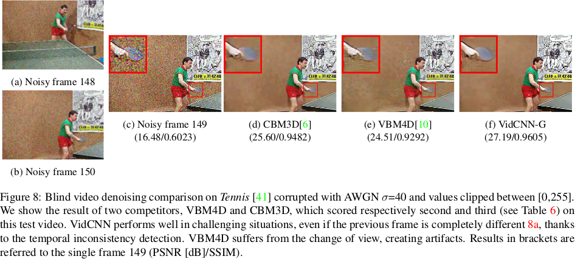

[](LICENSE)

# ViDeNN: Deep Blind Video Denoising


This repository contains my master thesis project called ViDeNN - Deep Blind Video Denoising.
The provided code is for testing purposes, I have not included the training part yet nor the self-recorded test videos.

# Introduction

With this pretrained tensorflow model you will be able to denoise videos affected by different types of degradation, such as Additive White Gaussian Noise and videos in Low-Light conditions. The latter has been tested only on one particular camera raw data, so it might not work on different sources. ViDeNN works in blind conditions, it does not require any information over the content of the input noisy video.




# Architecture

ViDeNN is a fully convolutional neural network and can denoise all different sizes of video, depending on the available memory on your machine.

# Requirements
```
tensorflow >= 1.4 (tested on 1.4 and 1.9)
numpy
opencv
ffmpeg
```

# How to denoise my own video?

If you have a noisy video file, you can use the script calling it in a terminal:
```
$ sh denoise.sh
```
It will first extract all the frames using FFmpeg and then start ViDeNN to perform blind video denoising.

# Issues?

Feel free to open an issue if you have any problem, I will do my best to help you.
